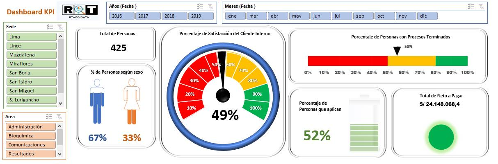

# Dashboard of KPI's R&T DATA

How to create a dashboard KPI's with EXCEL.

# Targets

* Uso en su mayoría de tablas dinámicas.
* Conteo del total de personas.
* Porcentaje de personas según sexo.
* Velocímetro para el porcentaje de Satisfacción del Cliente Interno.
* Gráfico lineal de Porcentaje de personas con procesos terminados.
* Gráfico tipo batería de Porcentaje de personas que aplican.
* Gráfico tipo semáforo de Total de neto a pagar.
* Segmentación por Años
* Segmentación por Meses
* Segmentación por Sede
* Segmentación por Área

## Screenshot

